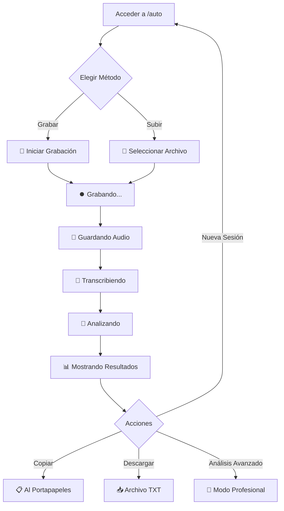

# 🎯 LA AURORA - Modo Automático

## ✨ Descripción
El **Modo Automático** de LA AURORA es una interfaz simplificada que procesa reuniones de forma completamente automática. Perfecto para usuarios que necesitan transcripción + resumen ejecutivo sin configuraciones complejas.

## 🚀 Características Principales

### 🎤 **Grabación Automática**
- Interfaz de un solo clic para iniciar grabación
- Timer visual en tiempo real
- Visualización de ondas de audio animadas
- Finalización automática del proceso

### 📁 **Subida de Archivos**
- Drag & drop o selección manual
- Soporte para MP3, WAV, M4A, WebM
- Procesamiento automático inmediato
- Sin configuraciones adicionales

### 🤖 **Procesamiento Inteligente**
- **Paso 1**: Guardado automático del audio
- **Paso 2**: Transcripción con Whisper local
- **Paso 3**: Análisis con Ollama local
- **Paso 4**: Generación de resumen ejecutivo

### 📊 **Resultados Profesionales**
- **Panel Izquierdo**: Transcripción completa
- **Panel Derecho**: Resumen ejecutivo estructurado
- Funciones de copia al portapapeles
- Descarga de archivo completo (.txt)

## 🔄 **Persistencia de Sesiones**

### ✅ **Qué se Guarda Automáticamente:**
- ✅ **Sesión completa** con metadatos
- ✅ **Audio original** (WebM/MP3)
- ✅ **Transcripción completa** de Whisper
- ✅ **Resumen ejecutivo** de Ollama
- ✅ **Archivo TXT** con todo el contenido
- ✅ **Duración** calculada automáticamente
- ✅ **Timestamp** y datos de sesión

### 📂 **Estructura de Archivos:**
```
sessions/
├── 2025-01-08_Reunion_Automatica_session-1234567890.json  # Datos de sesión
├── 2025-01-08_Reunion_Automatica_session-1234567890.txt   # Archivo legible
└── session-1234567890.webm                                # Audio original
```

### 🔗 **Integración con Modo Profesional:**
- Las sesiones automáticas aparecen en el sidebar del modo profesional
- Acceso completo a análisis avanzado
- Compatibilidad total con templates de IA
- Funciones de edición y re-procesamiento

## 🌐 **URLs de Acceso**

| Modo | URL | Descripción |
|------|-----|-------------|
| **Automático** | `http://localhost:3000/auto` | Procesamiento automático |
| **Profesional** | `http://localhost:3000/pro` | Interfaz avanzada completa |
| **Principal** | `http://localhost:3000` | Página de inicio |

## 🎯 **Flujo de Usuario**



## 🎨 **Características de UI/UX**

### ✨ **Animaciones y Efectos:**
- Cards con hover effects y shimmer
- Indicadores de estado en tiempo real
- Spinners de carga elegantes
- Transiciones suaves entre pantallas

### 📱 **Responsive Design:**
- Adaptable a móviles y tablets
- Layout de columnas flexibles
- Botones optimizados para touch
- Tipografía escalable

### 🎨 **Tema Visual:**
- Paleta de colores Material Design
- Tipografía Inter profesional
- Shadows y bordes redondeados
- Iconos emoji consistentes

## 🔧 **Configuración Técnica**

### 📋 **Dependencias:**
- Whisper local (modelo: base)
- Ollama local (modelo: gemma3:4b)
- Node.js + Express backend
- Vanilla JavaScript frontend

### ⚙️ **APIs Utilizadas:**
- `POST /transcribe` - Transcripción con Whisper
- `POST /process-with-ollama` - Análisis con IA
- `POST /api/sessions` - Guardado de sesiones
- `GET /api/sessions/:id` - Carga de sesiones

## 🎉 **Casos de Uso Ideales**

### 👔 **Reuniones Ejecutivas:**
- Juntas directivas rápidas
- Calls de seguimiento
- Briefings de proyecto
- Sesiones de brainstorming

### 📈 **Ventajas Competitivas:**
- **Velocidad**: Procesamiento en 1 clic
- **Simplicidad**: Sin configuraciones
- **Completitud**: Transcripción + Análisis
- **Privacidad**: 100% local, sin cloud
- **Integración**: Compatible con modo profesional

---

**🚀 ¡El Modo Automático está listo para usar!**  
Accede a `http://localhost:3000/auto` y experimenta el procesamiento automático de reuniones.